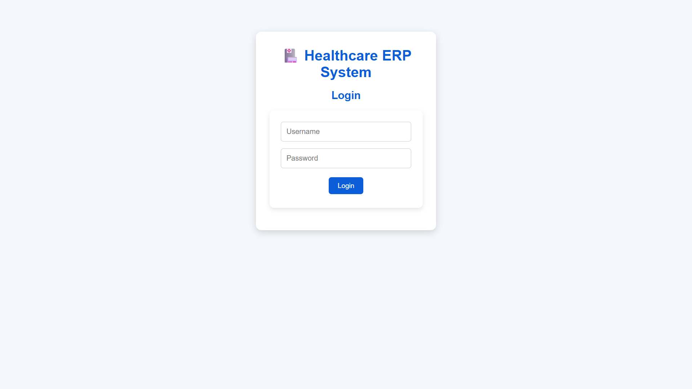
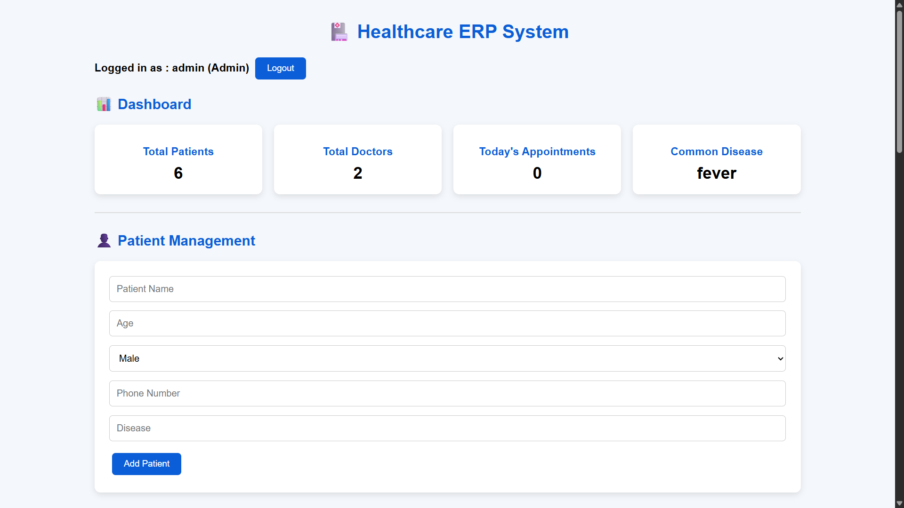
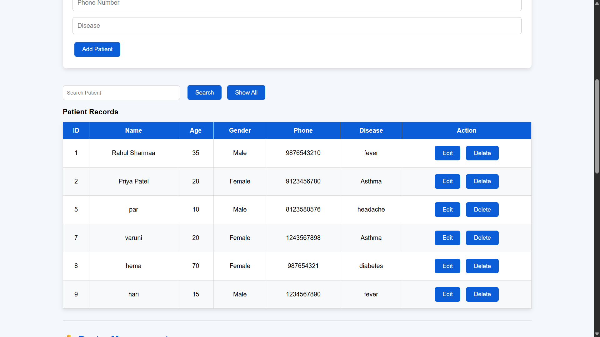
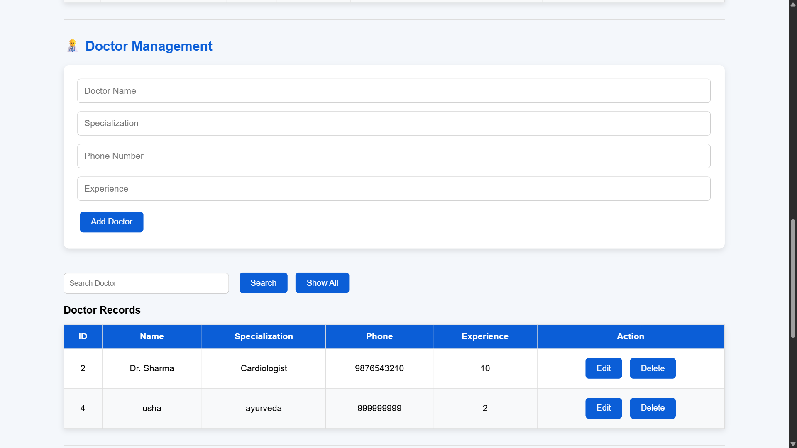
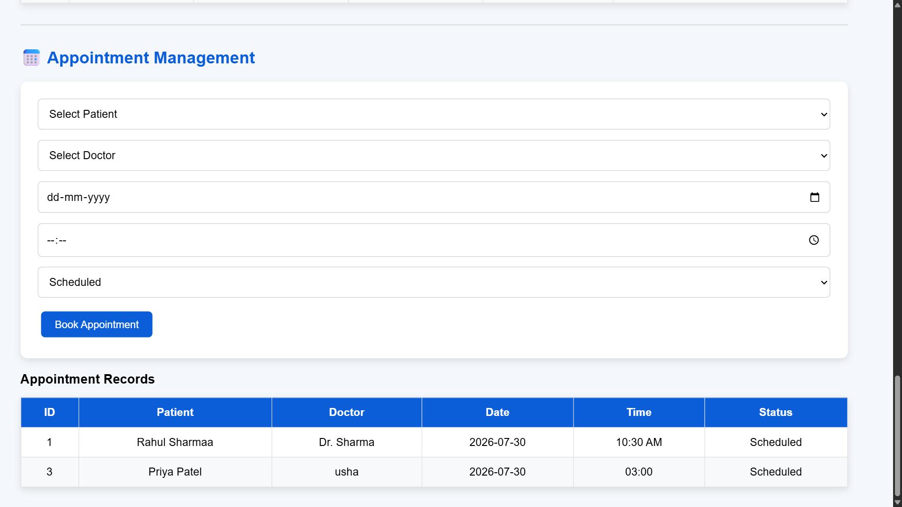

# Healthcare ERP System

A full-stack Healthcare ERP System built using Flask, SQLite, HTML, CSS, and JavaScript.

The application provides role-based authentication and supports the management of patients, doctors, appointments, and healthcare operations through an interactive dashboard.

---

## Features

### Authentication and Authorization

* Secure user login system
* Role-based access control
* Multiple user roles:

  * Admin
  * Doctor
  * Receptionist

### Patient Management

* Add new patients
* View patient records
* Update patient information
* Delete patient records
* Search patients

### Doctor Management

* Add doctors
* View doctor details
* Update doctor information
* Search doctors

### Appointment Management

* Schedule appointments
* View appointment details
* Manage healthcare appointments

### Dashboard Analytics

* Total patient count
* Total doctor count
* Today's appointments
* Healthcare statistics

---

## Technology Stack

### Frontend

* HTML5
* CSS3
* JavaScript

### Backend

* Python
* Flask
* REST APIs

### Database

* SQLite

### Development Tools

* Git
* GitHub
* Visual Studio Code

---

## Project Structure

```text
Healthcare-ERP-System/
│
├── backend/
│   ├── app.py
│   ├── database/
│   ├── models/
│   ├── routes/
│   ├── services/
│   └── requirements.txt
│
├── frontend/
│   ├── index.html
│   ├── css/
│   └── js/
│
├── screenshots/
│   ├── appointment.png
│   ├── appointmentmanager.png
│   ├── doctor.png
│   ├── doctormanagement.png
│   ├── paintientrecord.png
│   ├── patientmanagement.png
│   └── userpassword.png
│
├── README.md
└── .gitignore
```

---

## Screenshots

### Login and Authentication



---

### Patient Management



---

### Patient Records



---

### Doctor Management



---

### Appointment Management



---

## System Workflow

1. The user logs into the system.
2. Authentication verifies the user's credentials.
3. Access is provided based on the user's role.
4. Authorized users can manage patients, doctors, and appointments.
5. Application data is stored and retrieved using SQLite through the Flask backend.
6. The frontend communicates with the backend services to perform healthcare management operations.

---

## Installation and Setup

### Prerequisites

* Python 3.x
* Git
* A modern web browser

### 1. Clone the Repository

```bash
git clone https://github.com/TejashwaniIndoria/Healthcare-ERP-System.git
cd Healthcare-ERP-System
```

### 2. Navigate to the Backend

```bash
cd backend
```

### 3. Create a Virtual Environment

```bash
python -m venv venv
```

### 4. Activate the Virtual Environment

#### Windows

```bash
venv\Scripts\activate
```

### 5. Install Dependencies

```bash
pip install -r requirements.txt
```

### 6. Run the Flask Backend

```bash
python app.py
```

The Flask application will start on the local address configured by the application.

### 7. Open the Frontend

Open:

```text
frontend/index.html
```

in a web browser.

---

## Security

The project uses role-based authentication to control access to healthcare management functionality.

Sensitive configuration files, local databases, virtual environments, and other development-specific files should not be committed to the repository.

---

## Future Enhancements

* Appointment editing and cancellation
* Advanced reporting and analytics
* Email and SMS notifications
* Cloud database deployment
* Improved dashboard visualizations
* Enhanced user and role management
* Production-ready deployment

---

## Learning Outcomes

This project demonstrates practical experience in:

* Full-stack web application development
* REST API development using Flask
* CRUD operations
* Frontend and backend integration
* Role-based authentication
* SQLite database management
* Healthcare data management
* Git and GitHub version control

---

## Author

**Tejashwani Indoria**

Information Science and Engineering Student

GitHub: https://github.com/TejashwaniIndoria
